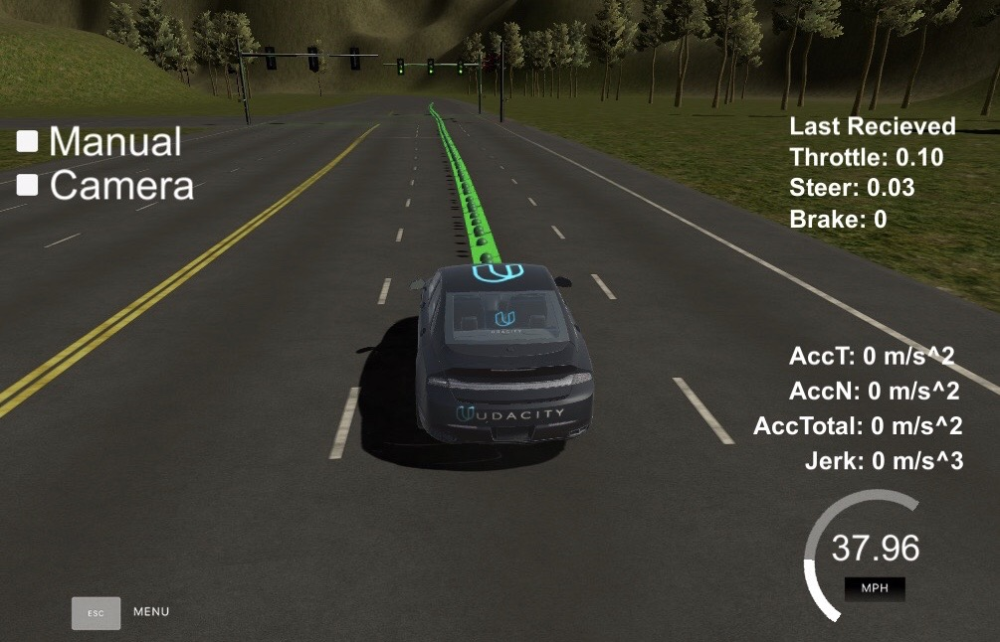
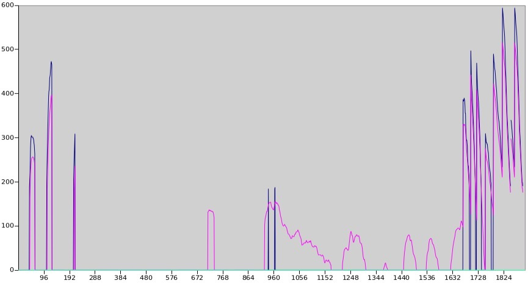
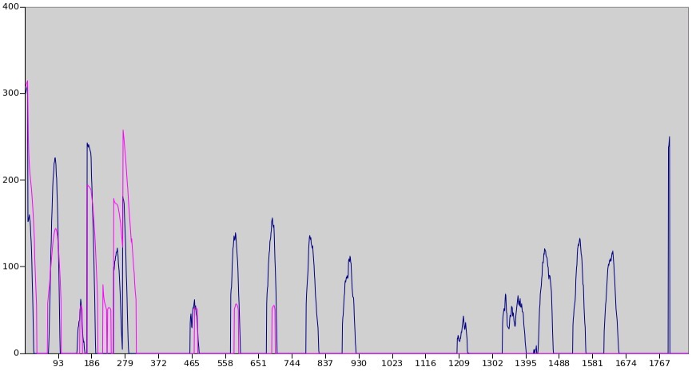

# Capstone Project - Program a Real Self-Driving Car

In this final project of Self Driving Car Nanodegree, we need to program necessary ROS nodes and integrate them to a whole self driving system, in order to make the car be able to navigate itself along the test track and stop before stop lines when red traffic light is detected. 

The project result was test both in the simulator and on the real road in California, USA.

In this project, we built up a team of 5 students from Udacity.

## System Overview

The above picture presents the system architecture showing the ROS nodes and topics used in the project.

In the following section, you will get more insights regarding to each component.

## Waypoints Updater
The purpose of this node is to publish a fixed number of waypoints ahead of the vehicle with the correct target velocities, depending on traffic lights and obstacles.

A visual presentation of the waypoints heading vehicle is following.

In the way points updater we took care of the maximal acceleration, deceleration and jerk limitations as physical boundaries in terms of velocity planning.

## Controllers
Controllers are responsible for transmitting the driving commands i.e. throttle percentage value, brake force and steering wheel angle to the drive by wire system in the test vehicle.

We implemented PID controller for throttle, two feed forward controllers respective for brake and steering wheel angle. 

Udacity provided a bag file with measurements of a controller as reference implementation. The bag file can be applied to our own controller, so that we can compare the reference and our implementation. 

We found the following issues:

* The brake was too weak. The reference implementation applies 2.5 - 3.0 higher brake force than our twist controller. Therefore we introduced a correction factor of 2.5 to fix this.

* Throttle is similar to Udacity's reference implementation, but a bit weaker. It shouldn't be a big drawback.

The following picture shows how the brake force is applied. Blue: Udacity, Red: ours. x-axis: sampling time sequences, y-axis: Nm

In the next picture you find how the throttle applied. Blue: Udacity, Red: ours, x-axis: sampling time sequences, y-axis: throttle_percentage * 1000. 

Udacity's throttle implementation looks a bit strange especially since they have throttle after sample 1767 where Udacity's brake controller also applies brake force at the same time. Overall our throttle can keep the vehicle speed stable around the given speed.

## Traffic Light Detection

This part should process the incoming traffic light position data and camera image to get color prediction and publish the location of any upcoming red lights, so that the waypoints updater will plan the velocity accordingly.

Because of the enorm scenario difference between simulation and real life, we decided to use two machine learning models to process respectively.

### Scenario Simulator 
We built a neural network, consists of 7 convolutional layers and 3 full connected layers, to process the full incoming image and predict the color in four categories (0:TrafficLight.RED , 1:TrafficLight.YELLOW ,2:TrafficLight.GREEN ,3:TrafficLight.UNKNOWN).

### Scenario Real-Life
Firstly we would find where the traffic light in the picture is and put them in boxes . Then we will predict based on the found boxes to predict the colours with the trained SSD mobileNet version 1 neural network. 

Furthermore, in the training process, we added pictures of cloudy and sunny weather to reduce the bias. 
