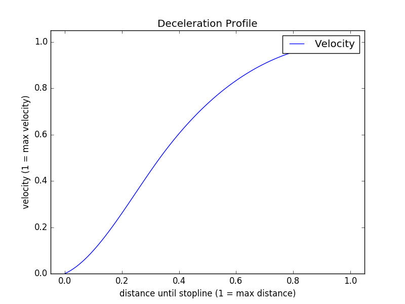

# Capstone Project - Program a Real Self-Driving Car

## Introduction
In this final project of Self Driving Car Nanodegree, we need to program necessary ROS nodes and integrate them to a whole self driving system, in order to make the car be able to navigate itself along the test track and stop before stop lines when red traffic light is detected.

In the Capstone Project of Udacity's "Selfdriving Car Nanodegree" program (CarND-13), a ROS based system needs to be implemented based on a given framework, in order to make a car follow a given trajectory. The project requires to design and implement
- a traffic light detection, which is capable of identifying traffic lights and their current status ("red" or "not red") in a simlator and in a real world scenario as well.
- a trajectory planner, which applies the required speed to the trajectory based on the current traffic light status.
- a motion controller to handle lateral and longitudinal velocity of the car.

The implementation is optimized based on a given simulated environment. Futhermore, it is prepared to be used in a real world application (Deployment on "Carla", Udacity's test car) by training the Machine Learning related algorithms with simulator and real world data. 

## Project Members
In this project, we built up a team of 5 students from Udacity.
Do we want to write anything here about our contact details?

## System Overview

The above picture presents the system architecture showing the ROS nodes and topics used in the project.

In the following section, you will get more insights regarding to each component.

## Waypoints Updater

The waypoints updater provides trajectory points to the motion control nodes through the topic "/final_waypoints". These waypoints are a set of trajectory points, which
- contain the trajectory points which are believed to be ahead of the vehicle.
- contain the required velocity for each trajectory point.

### Length of the Trajectory
A certain amount of trajecory points allows the motion controller to keep running even though the planner / waypoint updater has not sent trajectory for a certain time (the planner's trajectory publish frequency is much lower than the motion control sample time. Moreover, if the waypoint updater is delayed, the motion controller still has trajectory points left to follow). 

The current length of a trajectory is 50 point, which provides enough trajectory points to keep the motion controller busy for some seconds. The initially proposed length of 200 causes heavy delays between the ROS (running in a VM) and the simulator (running on native win10).

### Generation of the Trajectory for the Motion Controller

#### For constant velocity
The trajectory for the motion controller is generated simply by slicing the given trajectory. The vehicle itself has (by default, it was already given in the framework) a localisation feature which provides the current pose of the vehicle. Based on this pose the current trajectory point is found so that a short trajectory can be defined (sliced out) which is ahead of the vehicle. This short trajectory is then being provided to the motion controller. The velocity of each trajectory point is inherited from the original trajectory.

#### For changing velocity (red traffic light ahead)
If the velocity is required to be changed to due a red traffic light ahead, then the waypoint updater needs to adapt the speed in such a way that the vehicle is capable of stopping at the respective traffic light (to be more precise: At its stop line). For this purpose the "/traffic_waypoints" topic is used which contains the index of a detected red traffic light (if no red traffic light is detected, the index is set to -1. The index allows to identify the traffic light's stop lane along the given trajectory. The index represents a point in this trajectory). Once a red traffic light is reported to the waypoint_updater,
- the distance is being checked: If the car is close (only 50 waypoints ahead of the traffic light stop line), then the velocity is planned in such a way, that the car decelerates. If the car is only 10 meters ahead of the traffic light stop line at the moment, when it turns red (or is identified to be red), then it keeps its speed.
- the deceleration is planned according to the following image:

Note that the deceleration is planned based on the remaining distance between the car's center (its reference point) and the stop line.

#### Acceleration
Once the car is required to accelerate (red traffic light disappears), then the trajectory is again planned with maximum speed as provided by the original trajectory. The acceleration itself is then being handled smoothly by the throttle controller.

## Controllers
Controllers are responsible for generating the driving commands i.e. throttle percentage value, brake force and steering wheel angle to the drive by wire system in the test vehicle based on the the waypoints from the above waypoints updater. 

We implemented PID controller for throttle, two feed forward controllers respectively for brake and steering wheel angle. 

Udacity provided a bag file with measurements of a controller as reference implementation. The bag file can be applied to our own controller, so that we can compare the reference and our implementation. 

In the mean time we found the following issues:

* The brake was too weak. The reference implementation applies 2.5 - 3.0 higher brake force than our twist controller. Therefore we introduced a correction factor of 2.5 to fix this.

* Throttle is similar to Udacity's reference implementation, but a bit weaker. It shouldn't be a big drawback.

The following picture shows how the brake force is applied. Blue: Udacity, Red: ours. x-axis: sampling time sequences, y-axis: Nm

In the next picture you find how the throttle applied. Blue: Udacity, Red: ours, x-axis: sampling time sequences, y-axis: throttle_percentage * 1000. 

Udacity's throttle implementation looks a bit strange especially since they have throttle after sample 1767 where Udacity's brake controller also applies brake force at the same time. Overall our throttle can keep the vehicle speed stable around the given speed.

## Traffic Light Detection

This part should process the incoming traffic light position data and camera image to get color prediction and publish the location of any upcoming red lights, so that the waypoints updater will plan the velocity accordingly.

Because of the enorm scenario difference between simulation and real life, we decided to use two machine learning models to process respectively.

### Scenario Simulator 
We built a neural network, consists of 7 convolutional layers and 3 full connected layers, to process the full incoming image and predict the color in four categories (0:TrafficLight.RED , 1:TrafficLight.YELLOW ,2:TrafficLight.GREEN ,3:TrafficLight.UNKNOWN).

### Scenario Real-Life
Firstly we would find where the traffic light in the picture is and put them in boxes . Then we will predict based on the found boxes to predict the colours with the trained SSD mobileNet version 1 neural network. 

Furthermore, in the training process, we added pictures of cloudy and sunny weather to reduce the bias. 
