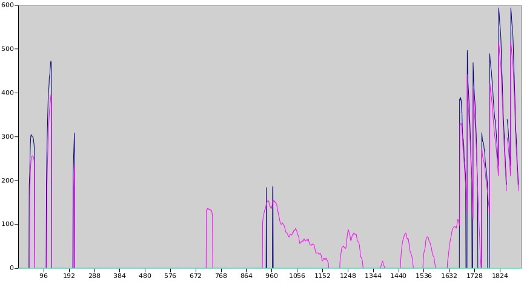
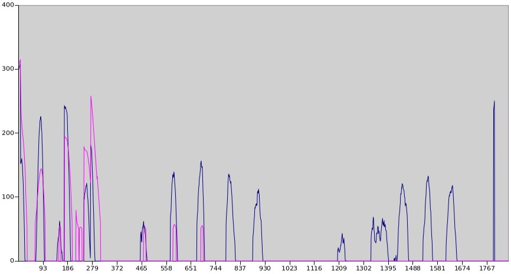

# Capstone Project - Program a Real Self-Driving Car

As the final project in the Self Driving Car Nanodegree, we need to program necessary ROS nodes and integrate them to a whole system. Then the car should be able to navigate itself along the test track and stop before stop lines if the red traffic light is detected. 

The project result was test both in the simulator and on the real road in California, USA.

In this project, we built up a team of 5 students from Udacity.

## System Overview

The above picture presents the system architecture showing the ROS nodes and topics used in the project.

In the following section, you will get more insights regarding to each component.

## Waypoints Updater
The purpose of this node is to publish a fixed number of waypoints ahead of the vehicle with the correct target velocities, depending on traffic lights and obstacles.

A visual presentation of the waypoints heading vehicle is following.

In the way ponts updater we took care of the maximal acceleration, deceleration and jerk limitations in terms of velocity planning.

## Controller
In the controller part, we implementated PID controller for throttle, two feed forward controllers for brake and steering wheel angle. 

Udacity provided a bag file with measurements of a controller reference implementation. The bag file can be applied to our own controller, so that we can compare the reference implementation and the own implementation. 

We found following issue:

* The brake is too weak. For an unknown reason, the reference implementation applies 2.5 - 3.0 higher brake force than our twist controller. Therefore we introduced a correction factor of 2.5 to fix this.

* Throttle is kind of similar to Udacity's reference implementation, but a bit weaker. It shouldn't be a big drawback.

Finally, the comparison is following:

The folowing picture shows how the brake force is applied. Blue: Udacity, Red: ours. x-axis: sampling time sequences, y-axis: Nm

In the next picture you find how the throttle applied. Blue: Udacity, Red: ours, x-axis: sampling time sequences, y-axis: throttle_percentage * 1000. Udacity's throttle implementation looks a bit strange especially since they have throttle after sample 1767 where Udacity's brake controller also applies brake force at the same time. Overall our throttle can keep the vehicle speed stable at the given speed.

## Traffic Light Detection
Because of the enorm szenario difference between simulator and real life situation, we decided to use two machine learning model to conduct the process respectively.

### Szenario Simulator

### Szenario Reallife

