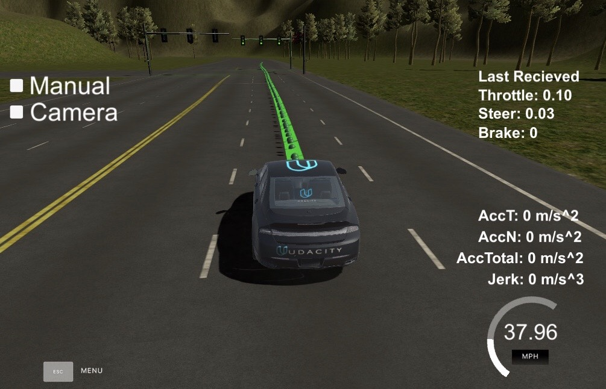

# Capstone Project - Program a Real Self-Driving Car

As the final project in the Self Driving Car Nanodegree, we need to program necessary ROS nodes and integrate them to a whole system. Then the car should be able to navigate itself along the test track and stop before stop lines if the red traffic light is detected. 

The project result was test both in the simulator and on the real road in California, USA.

In this project, we built up a team of 5 students from Udacity.

## System Overview

The above picture presents the system architecture showing the ROS nodes and topics used in the project.

In the following section, you will get more insights regarding to each component.

## Waypoints Updater
The purpose of this node is to publish a fixed number of waypoints ahead of the vehicle with the correct target velocities, depending on traffic lights and obstacles.

A visual presentation of the waypoints heading vehicle 

In the way ponts updater we took care of the maximal acceleration, deceleration and jerk limitations in terms of velocity planning.

## Controller

## Traffic Light Detection
Because of the enorm szenario difference between simulator and real life situation, we decided to use two machine learning model to conduct the process respectively.

### Szenario Simulator

### Szenario Reallife

